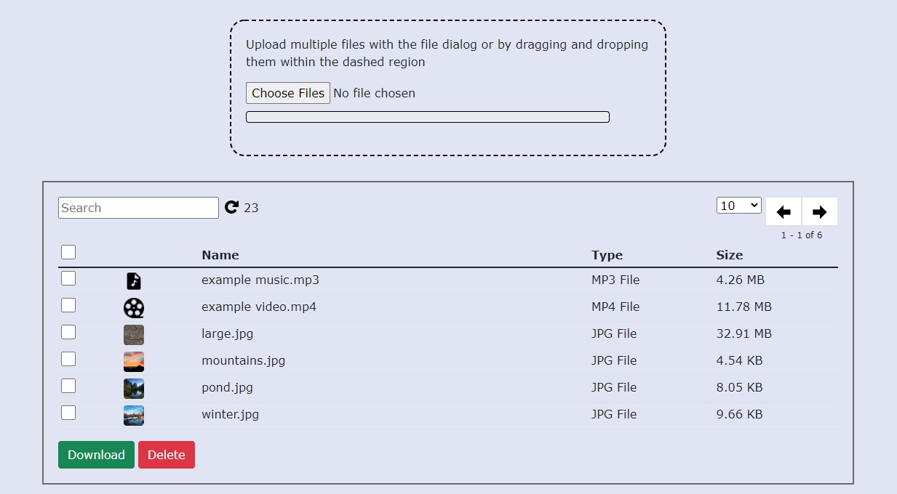

# Web File Transfer
Web File Transfer that gives you the ability to download and upload files to a server. Frontend written in React.JS and backend PHP.

 

# Requirements
- Node.JS for building into production and running server
- Web Hosting Software (nginx, xampp) for client
- Enable Read & Write for Server folder: sudo chmod -R 777 /var/www/html/

# Server Usage
- node server.js

# Client Usage
- npm install
- npm run build
- In your compiled build folder, move all three files/folders into your web server folder.